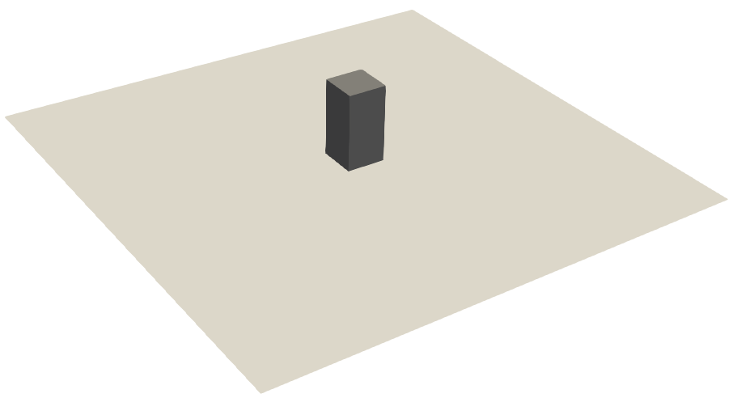
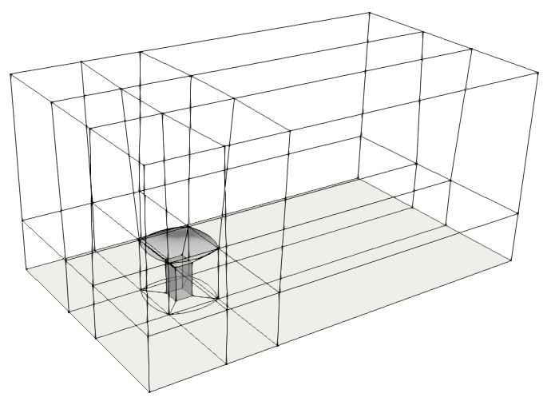
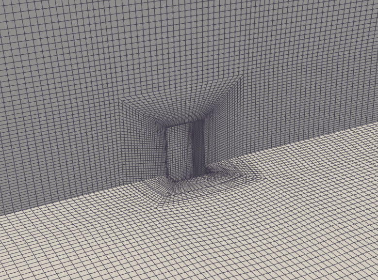
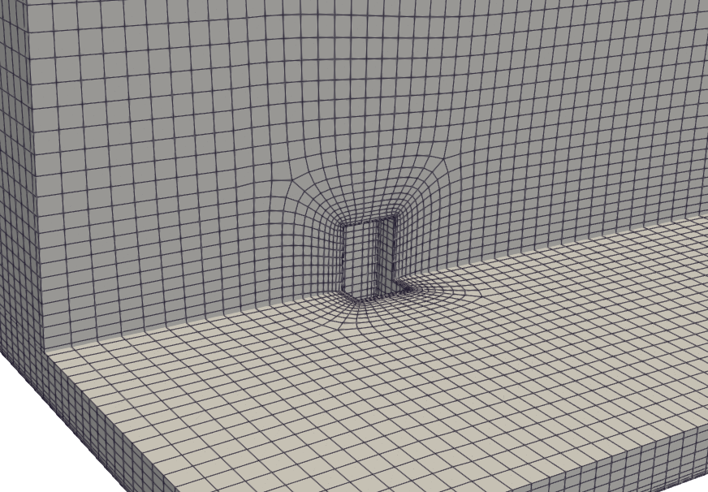
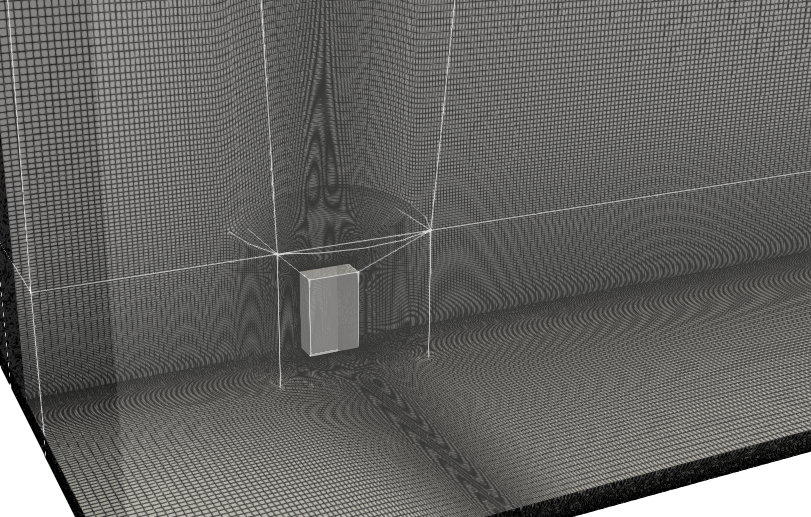

# Notes

    

* Scale-Adaptive unsteady RANS

* Inflow conditions are experimental; user can specify OF boundary conditions implemented in the `libatmosphericModels` library with required parameters in `./ABLConditions`.

* Wind tunnel lateral and top boundaries effects on domain of interest are not considered.

* Neutrally-stratified Atmospheric Boundary Layer with height of 0.6 m.

* Available "synthetic" information for LES simulation:
    - Reynolds stress tensor profiles from another experiment (AIJ_H case)
    with tensor terms as (Rxx Rxy Rxz Ryy Ryz Rzz)
    - Turbulent integral length scale profile (Lxu) from literature for neutral ABL
    computed as a function of boundary layer height

* Structured grid for high-wall resolution built with `blockMesh` utility; two parameters available:
    - `cells_scaling`: scaling factor for the number of cells in the x, y, and z directions
    - `building_ratio`: ratio of the building height to the building width (default is 2 which corresponds to the reference experiment); the grid maintains the same distance between building and top boundary

Two possibilities to build the grid are provided. The second grid scales better with cells_scaling parameter in order to be compatible to an high-fidelity LES simulation:
    - blockMeshDict/userDict/topoSetDict
    - blockMeshDict.new/userDict.new/topoSetDict.new

    

    

     
    <em>First grid available</em>

     
    <em>Second grid available</em>

* Enhanced solving stability with:
    - ramp up of inflow boundary condition (U, k, omega): 1  --> 100 *%*
    - ramp down of `maxCo`: 2.5 --> 0.2
    - ramp down of `nOuterCorrectors`: 5 --> 1
    - ramp up inner loops under-relaxation factors: 0.6 --> 1

* Mesh smoothing available based on external repository:
    - https://github.com/ptava/integration-cfmesh (for `improveMeshQuality` utility)

* Adaptive mesh refinement based on additional external repositories:
    - https://github.com/ptava/kOmegaSSTSAS (for `mykOmegaSSTSAS` turbulence model)
    - https://github.com/ptava/dynamicFvMesh (for `mydynamicFvMesh` library)
    - https://github.com/ptava/functionObjects (for additional function objects)

    ! Set `dumpRefinementInfo` in `dynamicMeshDict` to true to use additional function objects such as `FO_cuttingPlanesRefinement` and `FO_refinementInfo`

    ! Set `refineScale` in `dynamicMeshDict` as a Function1 to smoothly increase the number of refined cells over time

* Prepared for OpenFOAM by ESI-OpenCFD and OpenFOAM Foundation
