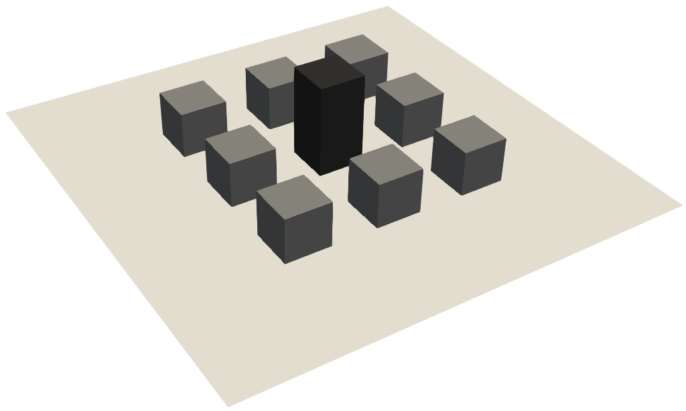

# Notes

    

* Scale-Adaptive unsteady RANS

* Inflow conditions are experimental.

* Wind tunnel lateral and top boundaries effects on domain of interest are not considered.

* Unstructured grid built with `blockMesh` and `snappyHexMesh` utilities.

* No need to smooth the grid.

* Available adaptive mesh refinement during the simulation.

* Prepared for OpenFOAM v13 (*resources_foundation*)

### Mesh generation

To generate the grid with SnappyHexMesh, we need to create a background mesh via blockMesh and then use the snappyHexMesh utility. Already defined to account for multiple directions of the inflow.

This meshing procedure can be applied to all scenarios, with central building height set to 0H, 1H, and 2H (set `case` variable in `userDict` file, values available `0H`, `1H`, `2H`).
Refinement regions limits and background-mesh-related parameters are defined in `userDict` file, along with the scaling parameter `cells_scaling` (this parameter is the actual characteristic length of cubes of main region of interest.

- *set_scenario* utility function modify domain extents and refinement regions based on the selected scenario.
- if user changes domain extents then *points* files in *boundaryData* need to be manually edited to match new domain dimensions.

|   Dictionary file        | Description                    |
|--------------------------|--------------------------------|
| blockMeshDict         | to create the background mesh         |
| snappyHexMeshDict     | to perform `castellated` procedure (no snap required if `cells_scaling` is set appropriately) |
| topoSetDict           | to extract next-to-wall cells for mesh smoothing |
| userDict              | to control grid definition parameters |

|STL file           | Description                                       |
|-------------------|---------------------------------------------------|
| BASE.stl          | common to all configurations (no central building)|
| 1H.stl            | central building height equal to 1H               |
| 2H.stl            | central building height equal to 2H               |

