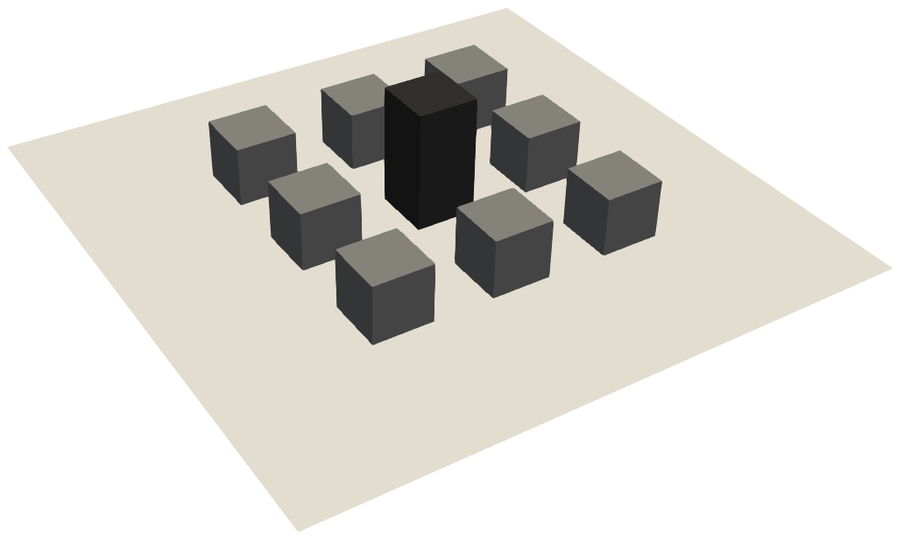

# Notes

    

* Scale-Adaptive unsteady RANS

* Inflow conditions are experimental.

* Wind tunnel lateral and top boundaries effects on domain of interest are not considered.

* Unstructured grid built with `blockMesh` and `snappyHexMesh` utilities.

* No need to smooth the grid.

* Available adaptive mesh refinement during the simulation.

* Prepared for OpenFOAM v13 (*resources_foundation*)

### Mesh generation

To generate the grid with SnappyHexMesh, we need to create a background mesh via blockMesh and then use the snappyHexMesh utility. Already defined to account for multiple directions of the inflow.

The `flowDirection` option in `system/userDict` supports the standard `0deg`, `22deg`, and `45deg` cases, plus `from45to22`. The transition case keeps the 45deg grid/domain setup and expects a dedicated `boundaryData_from45to22` data set that encodes the 45deg acquisition, the transient switch, the stabilization period, and the 22deg acquisition window.

For the `resources_foundation` workflow, the acquisition windows are configured at the top of [bin/Allrun_case](/home/smartlab/Documents/Repositories/DANTE-model-evaluation/resources/case_studies/AIJ_C/resources_foundation/bin/Allrun_case) and written into `system/controlDict` by [bin/Set_scenario](/home/smartlab/Documents/Repositories/DANTE-model-evaluation/resources/case_studies/AIJ_C/resources_foundation/bin/Set_scenario).

- `acq_start`, `acq_stop`, `hf_stop` define the main acquisition window and set `foStartAverage`, `foLfStart`, `foHfStart`, `foEndAverage`, `foLfEnd`, and `foHfEnd`.
- `acq_start2`, `acq_stop2`, `hf_stop2` are used only for `from45to22` and set the second-window entries `foStartAverage2`, `foLfStart2`, `foHfStart2`, `foEndAverage2`, `foLfEnd2`, and `foHfEnd2`.
- `lf_dt` and `hf_dt` are shared by both windows and set `foLfDeltaT` and `foHfDeltaT`.
- The simulation `endTime` is set automatically to `acq_stop` for standard cases and to `acq_stop2` for `from45to22`.
- Warning: these parameters do not modify the time values stored in `boundaryData`. The boundary-condition time series remain fixed, so if the acquisition windows are changed the boundary-data timestamps must still be consistent with the selected setup.

This meshing procedure can be applied to all scenarios, with central building height set to 0H, 1H, and 2H (set `case` variable in `userDict` file, values available `0H`, `1H`, `2H`).
Refinement regions limits and background-mesh-related parameters are defined in `userDict` file, along with the scaling parameter `cells_scaling` (this parameter is the actual characteristic length of cubes of main region of interest.

- *set_scenario* utility function modify domain extents and refinement regions based on the selected scenario.
- if user changes domain extents then *points* files in *boundaryData* need to be manually edited to match new domain dimensions.
- *snappyHexMesh* by default runs in serial due to possible bug with *overwrite* option

|   Dictionary file        | Description                    |
|--------------------------|--------------------------------|
| blockMeshDict         | to create the background mesh         |
| snappyHexMeshDict     | to perform `castellated` procedure (no snap required if `cells_scaling` is set appropriately) |
| topoSetDict           | to extract next-to-wall cells for mesh smoothing |
| userDict              | to control grid definition parameters |

|STL file           | Description                                       |
|-------------------|---------------------------------------------------|
| BASE.stl          | common to all configurations (no central building)|
| 1H.stl            | central building height equal to 1H               |
| 2H.stl            | central building height equal to 2H               |
